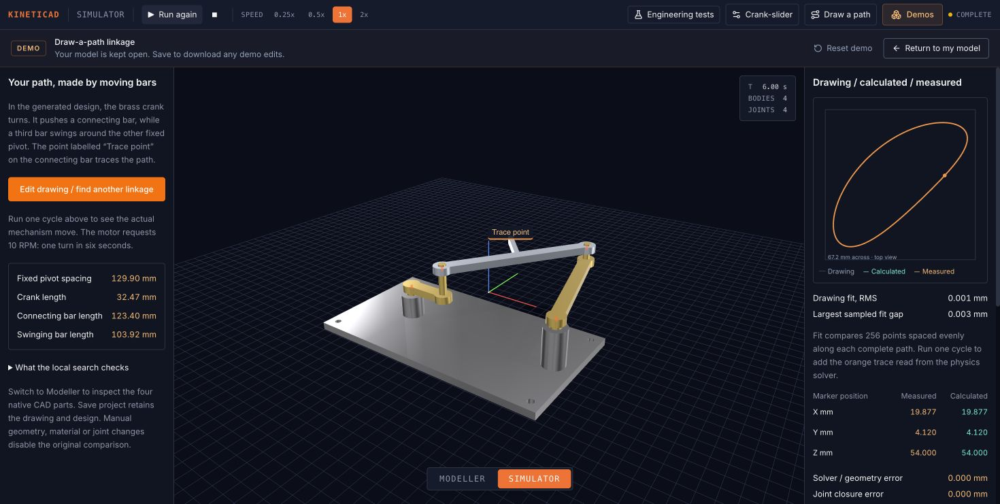

# Four-bar path designer: equations, use and verification

The path designer searches for a planar four-bar mechanism whose marked material point traces a requested closed loop. It creates four native editable CAD parts and four revolute joints. Only the input crank receives an ideal motor command; the moving parts and the measured trail follow the rigid-body solver.

KinetiCAD was originally built by Andrew Blumson and Kevin Blumson with Replit Agent. This later implementation and its automated checks were developed with Codex. Neither tool identity nor a passing test count is mathematical certification. The results below establish the stated fixtures, measurements and tolerances.

## Evidence status

The fresh [mathematics/search report](four-bar-search-results.json) records **13/13 passing tests**, with exact source hashes, timestamps, command arguments, complete TAP output, seeds and measured search results. That capture exercises pure geometry/search and the actual search worker through a Node message-endpoint adapter. It does **not** run OpenCascade, Rapier, Chrome or the whole repository test suite.

The independent [native geometry report](four-bar-geometry-results.json) records seven selected geometries, 28 valid single solids, 168 sampled assembly poses and 1,008 exact Boolean intersections, with no positive overlap found. The [actual Rapier report](four-bar-physics-results.json) passes 34 motion scenarios. The [shipped CAD worker report](four-bar-worker-cad-results.json) adds eight valid solids, six independent exact-volume checks and rejection of a disconnected candidate. These are separate evidence families; no aggregate or browser acceptance is implied by the 13-test search result.

The current [full regression record](four-bar-validation.json) and [individual test catalog](FOUR-BAR-TEST-CATALOG.md) identify the tested source hashes and runtime. [Actual Chrome evidence](evidence/four-bar/browser.json) records local search/cancel, a custom keyboard loop and a preset, native CAD creation, Save/Load/refresh, actual solver traces, lifecycle controls, exports and manual-reference invalidation. Older browser captures and earlier whole-repository totals retain their own scope. See [Physics verification](PHYSICS-VERIFICATION.md) for the wider project context and [Mathematics and physics](MATHEMATICS-AND-PHYSICS.md) for existing units, inertia and solver conventions.

## Using the feature

1. Open **Draw a path**. The initial known reference opens at its stored 60 mm source width. Choose another known mechanism preset, choose the ellipse target, or draw your own outline.
2. Make one closed loop without self-crossings or retraced segments. If the stroke ends away from its beginning, inspect the displayed closing segment and choose **Close loop**. The keyboard point editor accepts X,Y coordinate pairs and explicitly joins the last point to the first when you apply them.
3. Set **Path width** between 40 and 160 mm. Height scales in proportion. This controls the requested drawing; it does not guarantee that an exact mechanism inside the supported dimension limits exists at every width.
4. Choose **Find a mechanism**. The search runs locally in a worker without an AI service. Progress and the orange candidate are provisional. **Cancel search** terminates that worker and preserves the drawing and existing model.
5. Read **Typical path gap (RMS)** and **Worst sampled path gap**. They describe geometric shape agreement, allowing a different starting point and direction around the loop. They do not mean the tracer moves at the speed at which the outline was drawn.
6. Choose **Build editable model** only after inspecting the fit. Full native feature chains and mass data are prepared before the generated workspace is entered. Play the built mechanism to compare its actual solver trail with the prediction. The supported programme is one turn in six simulated seconds at 10 RPM.
7. Use native **Save** to retain the target, parameters, search seed and editable feature histories. The protected generated-workspace session preserves the original model for **Return to my model**. STEP/STL exports describe geometry; they do not preserve the optimiser, drawing or native feature history.

The three known targets originate from declared four-bar parameters. Their stored 60 mm-wide examples remain inside the supported mechanism bounds. They are useful references, not evidence that an arbitrary drawing can be reproduced exactly. The ellipse is deliberately labelled an approximate-fit target. Changing width can place even a known target's original generator outside the supported dimension range; a subsequent search then finds an admissible approximation.

## Coordinate and mechanism contract

The implementation is [fourBarKinematics.ts](../artifacts/kineticad/src/mechanisms/fourBarKinematics.ts). All lengths and Cartesian positions are millimetres. Angles in geometry equations are radians; saved UI rotation fields are degrees. Angular velocity is rad/s, and time is seconds unless a field explicitly says milliseconds.

The saved `FourBarParams` fields are:

| Field | Meaning |
|---|---|
| `groundLengthMm = d` | Distance between fixed input and output pivots |
| `crankLengthMm = a` | Input pivot to moving crank pin |
| `couplerLengthMm = b` | Distance between the two moving pins |
| `rockerLengthMm = c` | Fixed output pivot to moving rocker pin |
| `couplerPointLocalMm = [u,v]` | Tracer coordinates on the coupler: origin at the crank pin, local +X toward the rocker pin |
| `branch` | Signed choice of one of the two circle-intersection assemblies, either +1 or −1 |
| `originMm`, `rotationDeg` | Translation and in-plane rotation of the entire mechanism |
| `initialCrankAngleDeg`, `rpm` | Initial input angle and ideal input speed |

The general mathematics validator accepts finite speeds up to ±30 RPM and bounded initial angles. The generated-workspace profile is narrower: **initial angle zero, ±10 RPM, zero gravity, 120 Hz fixed stepping and a 6,000 ms duration**. The designer currently produces +10 RPM. Reverse motion is a separate numerical acceptance case, not an additional GUI speed control.

The world transform is applied once:

$$
\mathbf q_w=\mathbf o+R(\phi)\mathbf q,\qquad
R(\phi)=\begin{bmatrix}\cos\phi&-\sin\phi\\\sin\phi&\cos\phi\end{bmatrix}.
$$

All revolute axes are local +Z. Part orientations differ only by rotation about that axis, satisfying the pinned Rapier 0.12 binding's shared-local-axis limitation. No unsupported planar mate or separately oriented revolute frame is used. The traced material point has nominal world height **54 mm**.

## Exact closure and assembly branch

In the canonical ground frame, fixed pivots are `O=(0,0)` and `D=(d,0)`. For input angle θ, the crank pin is:

$$
\mathbf A=a(\cos\theta,\sin\theta),\quad
\mathbf e=\frac{\mathbf D-\mathbf A}{r},\quad r=\|\mathbf D-\mathbf A\|.
$$

The rocker pin B is the intersection of a circle of radius b around A and a circle of radius c around D. With J denoting a positive 90° planar rotation:

$$
x=\frac{b^2-c^2+r^2}{2r},\qquad
h=\sqrt{b^2-x^2},\qquad
\mathbf B=\mathbf A+x\mathbf e+\sigma hJ\mathbf e,\quad\sigma\in\{-1,+1\}.
$$

The tracer is a fixed point on that coupler:

$$
\mathbf P=\mathbf A+\frac{u}{b}(\mathbf B-\mathbf A)
+\frac{v}{b}J(\mathbf B-\mathbf A).
$$

Its location is not independently animated. The sign of `cross(D−A,B−A)` equals σ. Strictly positive h throughout the full input revolution keeps the selected branch continuous; the implementation rejects degenerate or unreachable circles rather than clamping them into a fabricated intersection.

An independent test oracle uses the cosine law and an angle construction instead of the production Cartesian intersection:

$$
\beta=\operatorname{atan2}(D_y-A_y,D_x-A_x)
+\sigma\arccos\left(\frac{b^2+r^2-c^2}{2br}\right),\qquad
\mathbf B=\mathbf A+b(\cos\beta,\sin\beta).
$$

That oracle is retained in [four-bar-reference.mjs](../artifacts/kineticad/tests/helpers/four-bar-reference.mjs). It is a separate implementation of the same rigid-link geometry, not a second physics engine.

## Full-cycle and nondegeneracy bounds

For a Grashof four-bar with a uniquely shortest side link, fixing the adjacent ground link gives the crank-rocker arrangement. Equality is a change-point case, which this implementation excludes. [CMU mechanism course, classification and transmission angle](https://www.cs.cmu.edu/~rapidproto/mechanisms/chpt5.html)

Let s and l be the shortest and longest lengths, and p and q the other two. The accepted product family requires:

$$
p+q-s-l\ge2\text{ mm},\quad
\min(d,b,c)-a\ge2\text{ mm},\quad d-a\ge22\text{ mm}.
$$

Because d>a, the circle-centre separation spans exactly `[d−a,d+a]` during a complete input turn. Both strict triangle inequalities therefore hold continuously if:

$$
(d-a)-|b-c|\ge2\text{ mm},\qquad
b+c-(d+a)\ge2\text{ mm}.
$$

These checks are not just tests at a few sampled angles. They bound every value of θ. They are consistent with geometric mobility analysis using triangle inequalities and explicit circuit/branch reasoning. [Bai, *Geometric analysis of coupler-link mobility and circuits for planar four-bar linkages*, 2017](https://homes.m-tech.aau.dk/shb/papers/2017-MMT-CouplerLinkMobility-Bai.pdf)

The transmission angle μ is the angle between the coupler and rocker at B. Its cosine is:

$$
\cos\mu(r)=\frac{b^2+c^2-r^2}{2bc}.
$$

It is monotone in r, so the largest absolute cosine occurs at one of the two endpoint separations. The validator requires:

$$
\max\{|\cos\mu(d-a)|,|\cos\mu(d+a)|\}\le\cos20^\circ.
$$

Thus μ stays between 20° and 160°, keeping the velocity-equation determinant away from zero. **The 2 mm margins and 20° limit are this implementation's chosen bounded operating domain, not a manufacturing or mechanical-design standard.** They do not establish useful output torque or bearing life.

Additional parameter limits are:

| Quantity | Accepted range |
|---|---|
| Ground d | 60–160 mm |
| Crank a | 15–50 mm |
| Coupler b and rocker c | 35–200 mm each |
| Tracer u | −0.25b to +1.25b |
| Tracer v | −0.5b to +0.5b |
| Tracer distance from either pin centre | At least 6 mm |
| World origin coordinates | Each within ±1,000 mm |

Finite-number, array-shape, branch and angle checks also apply. A generated result may occupy only part of this domain because several constraints must hold simultaneously.

## Velocity and acceleration references

The production reference exposes derivatives for mathematical checking. The initial product readout deliberately reports actual tracer **position**, not tracer velocity or acceleration. A body's centre-of-mass velocity would not be the velocity of this offset material point.

Primes below denote derivatives with respect to input angle θ. Let `bvec=B−A`, `cvec=B−D`, and let M have those two row vectors. Differentiating the two squared-link-length constraints gives:

$$
M\mathbf B'=\begin{bmatrix}\mathbf b\cdot\mathbf A'\\0\end{bmatrix},\qquad
M\mathbf B''=\begin{bmatrix}
\mathbf b\cdot\mathbf A''-\|\mathbf B'-\mathbf A'\|^2\\
-\|\mathbf B'\|^2
\end{bmatrix},
$$

where `A′=a(−sinθ,cosθ)` and `A″=−A`. Define `C=(u/b)I+(v/b)J`. Then:

$$
\mathbf P'=\mathbf A'+C(\mathbf B'-\mathbf A'),\quad
\mathbf P''=\mathbf A''+C(\mathbf B''-\mathbf A''),\quad
\dot{\mathbf P}=\mathbf P'\omega,\quad
\ddot{\mathbf P}=\mathbf P''\omega^2+\mathbf P'\alpha.
$$

These expressions are checked against central finite differences of independently sampled positions, including a nonzero input angular acceleration, both speed directions and translated/rotated placement. Passing that reference-math test does not establish the accuracy of Rapier tracer acceleration.

## Native geometry and continuous clearance model

The factory is [fourBarAssembly.ts](../artifacts/kineticad/src/mechanisms/fourBarAssembly.ts). The ground, crank, coupler and rocker are four separate single-solid bodies. The coupler's tracer boss is connected by actual material; it is not a hovering graphical point.

The moving plates occupy different height bands:

| Part | Plate Z interval |
|---|---|
| Crank | 27–33 mm |
| Rocker | 39–45 mm |
| Coupler and complete tracer arm | 51–57 mm |

The bed is 6 mm thick. Input and output bearing supports stop at 24 and 36 mm respectively. Spindles are radius 4 mm inside radius 4.5 mm bores; moving pins are radius 3 mm inside radius 3.5 mm bores. Final subtractive bore operations occur after the tracer-arm unions so later additions cannot refill a bore.

The tall input connecting pin passes through the rocker's height. Since the complete rocker outline lies within a radius-7 mm capsule around segment DB, its planar clearance from the radius-3 mm pin at A is bounded by:

$$
\operatorname{distance}(A,\operatorname{line}DB)-(3+7)
=b|\sin\mu|-10
\ge35\sin20^\circ-10
\approx1.9707\text{ mm}.
$$

Distance to the finite segment cannot be less than distance to its infinite line. The raised output support is clear of the whole crank sweep by:

$$
d-a-(9+7)\ge6\text{ mm}.
$$

The plate bands leave 6 mm gaps between successive moving plates; each grounded bearing support has a 3 mm gap below its corresponding plate. The coupler is 15 mm above the tallest support. The tracer boss remains at least `6−3.5−2=0.5 mm` from either pin bore. These are conservative inequalities for the **authored factory envelopes**. Changing a strap, boss, support, pin, feature or transform invalidates this proof.

Ordinary assembly contacts remain disabled. The clearance evidence establishes geometric separation in the defined construction, not contact forces, bearing friction, toleranced fits or a physical impact response. The ideal joints enforce the mechanism even though the model includes visible bore clearance.

The independent OCCT checks rebuild four actual feature chains for each of seven assemblies and require each result to be valid, contain exactly one solid and have positive volume. A radius-0.1 mm, height-6 mm cylindrical probe at each tracing point must be contained in its coupler material: expected intersection `π·0.1²·6=0.1884955592 mm³`, within `10⁻⁷ mm³`. For each geometry, both assembly branches and twelve input angles spaced 30° apart are checked, including all six body pairs. Total: **7×2×12×6=1,008 intersection checks**, with allowed volume at most **10⁻⁵ mm³** and observed maximum **0 mm³**. These exact B-rep checks are discrete; the continuous envelope inequalities supply the separate full-cycle argument.

## What the optimiser actually minimises

The search implementation is [fourBarSynthesis.ts](../artifacts/kineticad/src/mechanisms/fourBarSynthesis.ts). The worker is [fourBarSearchWorker.ts](../artifacts/kineticad/src/mechanisms/fourBarSearchWorker.ts).

Targets must contain 3–512 vertices plus a repeated starting vertex. Coordinates must be finite, each within ±1,000 mm; the outline must span 10–500 mm, have a 25–2,000 mm perimeter and enclose at least 1 mm². Closure tolerance is `10⁻⁷ mm`. Adjacent duplicate samples are removed; self-crossings, nonadjacent touches and retraced segments reject. Collinear extra drawing samples do not change arc-length resampling. The GUI's 40–160 mm width control is narrower than these input-validation limits.

Search candidates use dimensionless genes:

$$
(a/d,\ b/d,\ c/d,\ u/b,\ v/b,\text{branch gene}).
$$

Positive/negative branch-gene values select the two assembly branches. The dimensionless ratios are converted to millimetres only after deriving a feasible scale interval from the physical length, clearance, marker and nondegeneracy limits. Rotation, translation and uniform scale are fitted analytically for each complete-loop correspondence; nonuniform stretching and reflected rigid placement are not used.

The default implementation uses seeded differential evolution: population 64, 128 generations, mutation factor 0.7 and crossover probability 0.9 with at least one forced mutated gene. The three known mechanisms and their opposite branches initialise six population slots; the other slots use seeded random values. Invalid candidates receive no usable fitness. **64 initial evaluations plus 128×64 trial evaluations = 8,256 checks.** A fixed evaluation count and integer PRNG seed make reruns repeatable for the same implementation/runtime; this is not a cross-browser floating-point determinism guarantee.

Differential evolution has been published for planar mechanism synthesis, with explicit treatment of Grashof constraints, ordering and paths with or without prescribed timing. This feature uses its own bounded implementation and whole-loop objective; it does not claim to reproduce a paper's benchmark or prove a global optimum. [Peñuñuri et al., *Synthesis of Mechanism for single- and hybrid-tasks using Differential Evolution*, 2011](https://arxiv.org/abs/1102.2017)

For search fitness, a complete predicted input revolution is sampled at 256 angles and resampled to 64 equal arc-length positions. The requested polyline is likewise resampled to 64 positions. Every cyclic start index and both traversal directions are considered. For each correspondence, centred point clouds give an analytic least-squares rotation and feasible uniform scale. Search fitness is complete-loop RMS distance, not one-way distance to whichever small portion happens to be close.

The final result is recomputed independently of provisional progress: **2,048 predicted crank-angle samples**, then **256 equal arc-length comparison samples**. At fixed candidate dimensions and placement, it optimises a single shared cyclic phase along the sampled target, including fractional positions between target samples, and either traversal direction. It does not independently reorder each point.

For paired predicted points Pi and corresponding target positions Ti:

$$
E_{RMS}=\sqrt{\frac1N\sum_i\|P_i-T_i\|^2},\qquad
E_{max}=\max_i\|P_i-T_i\|.
$$

The secondary two-way sampled nearest-segment distance is the maximum of predicted samples' distances to target segments and target samples' distances to dense predicted segments. It is reported separately; it is not substituted for the order-preserving RMS objective. All three are **sampled geometric measures**, not continuous maximum-error certificates or time-synchronised tracking errors.

Progress is posted after initialisation and each generation: 129 messages in the default run. The worker yields between generations. Each search owns a worker; terminating it cancels computation. Request IDs and UI invalidation keep late messages from building a stale result. Search does not replace the native model; that is an explicit later action.

## Recorded mathematical and search results

The [fresh JSON capture](four-bar-search-results.json) passed 13 tests in **16.358843 s** of Node-reported test time (**16.550883 s** process wall time). Its two default-budget search cases are:

| Case | Seed | Evaluations | Measured duration | RMS gap | Worst paired gap | Two-way sampled nearest-segment gap | Gates |
|---|---:|---:|---:|---:|---:|---:|---|
| Ellipse, actual worker | 42 | 8,256 | 6.915304 s | 0.0882973003 mm | 0.1770501669 mm | 0.1769884275 mm | RMS <0.3 mm; paired maximum <0.6 mm |
| Held-out mechanism path | 73 | 8,256 | 6.279169 s | 0.0574098795 mm | 0.1269417546 mm | 0.1267569534 mm | RMS <1 mm; paired maximum <3 mm |

These are fixture-specific checks, not promised errors or runtimes for every drawing. The ellipse is 60 mm wide and 40 mm high. The held-out target contains 500 geometric samples plus its repeated endpoint. It was generated using `d=112,a=31,b=101,c=91 mm`, tracer `[72,−12] mm`, branch −1, origin `[−50,37] mm` and rotation 37°. **Only the resulting points and seed were given to the optimiser; those hidden parameters were not supplied or included among the known population seeds.** The recovered mechanism differs from that source mechanism, illustrating that fitting a path does not uniquely identify its generator.

The three known presets pass their declared source-geometry comparisons within 0.005 mm RMS and maximum gap; their seeded short searches pass 0.01 mm RMS. A known smooth mechanism curve and its 256-segment saved polyline have a small discretisation difference, so the report does not claim a literal zero sampled gap.

The 13 tests are individually enumerated below; loops inside a test are scenarios or samples, not extra Node tests:

| Test | Independent check and acceptance |
|---|---|
| [Exact coordinates and both branches](../artifacts/kineticad/tests/four-bar-kinematics.test.mjs#L9) | At θ=0 for d=100, a=25, b=95, c=80 mm, B=(80,±√6000); explicit tracer coordinates within 10⁻¹² mm |
| [Full rotations and clearance bounds](../artifacts/kineticad/tests/four-bar-kinematics.test.mjs#L19) | Two geometries, both branches, 721 angles each; all three moving lengths within 10⁻¹⁰ mm, signed branch preserved, point-to-line clearance above the derived bound |
| [Velocity and acceleration](../artifacts/kineticad/tests/four-bar-kinematics.test.mjs#L33) | Five angles, three input speeds, nonzero α and rotated placement; central difference step 0.0001 s; velocity error ≤2×10⁻⁶ mm/s and acceleration error ≤2×10⁻⁵ mm/s² |
| [Transform and periodicity](../artifacts/kineticad/tests/four-bar-kinematics.test.mjs#L47) | Independent 90° rotation/translation and a complete turn agree within 10⁻¹⁰ mm; sampled endpoint explicitly closes |
| [Invalid mechanism rejection](../artifacts/kineticad/tests/four-bar-kinematics.test.mjs#L55) | Grashof equality, unreachable circles, small transmission angle, insufficient margin, invalid marker, branch, nonfinite and out-of-bound inputs reject |
| [Target validation](../artifacts/kineticad/tests/four-bar-synthesis.test.mjs#L6) | Open, crossing, retraced, undersized, oversized-count and nonfinite paths reject; scaling preserves aspect ratio |
| [Drawing-speed independence](../artifacts/kineticad/tests/four-bar-synthesis.test.mjs#L16) | Sparse rectangle and unevenly sampled identical outline produce exactly equal arc-length samples |
| [Known versus approximate targets](../artifacts/kineticad/tests/four-bar-synthesis.test.mjs#L22) | Declared known parameters and short seeded searches pass their polygon gates; ellipse has no claimed known generator |
| [Complete-loop scoring](../artifacts/kineticad/tests/four-bar-synthesis.test.mjs#L32) | Cyclic start and reversal retain a close score; a displaced target cannot be aligned for free and a half-sized target cannot win by matching a small portion |
| [Determinism, progress and cancellation](../artifacts/kineticad/tests/four-bar-synthesis.test.mjs#L42) | Same seed/config yields exactly equal outputs in the tested runtime; evaluations increase as 16/32/48/64, best provisional RMS does not worsen; cancellation and invalid budgets reject |
| [Unseeded parameter target](../artifacts/kineticad/tests/four-bar-synthesis.test.mjs#L53) | Default search receives only held-out path points, reaches 8,256 evaluations and passes the recorded 1 mm RMS / 3 mm maximum gates; final score independently recomputes exactly |
| [Actual worker completion](../artifacts/kineticad/tests/four-bar-search-worker.test.mjs#L16) | Production worker emits 129 correctly identified progress messages and the ellipse result; returned final metrics recompute exactly |
| [Actual worker termination/error](../artifacts/kineticad/tests/four-bar-search-worker.test.mjs#L36) | Terminate after provisional progress: no final result. A fresh worker rejects an invalid target with its request ID |

## Actual solver comparison and protected persistence

The native geometry and solver acceptance files are [four-bar-cad.test.mjs](../artifacts/kineticad/tests/four-bar-cad.test.mjs) and [four-bar-physics.test.mjs](../artifacts/kineticad/tests/four-bar-physics.test.mjs). The implementation has not changed the pinned Rapier/OpenCascade packages or the global baseline solver profile. The specialised four-bar numerical profile is **32 outer solver iterations, 16 internal PGS iterations and motor velocity gain 1,000,000**. That gain is a solver parameter, not a motor torque or power rating. [fourBarSolver.ts](../artifacts/kineticad/src/mechanisms/fourBarSolver.ts)

The final [Rapier report](four-bar-physics-results.json) contains **34 scenarios**: seven geometries × two branches × two speed directions at 120 Hz gives 28; the default geometry at 240 Hz adds one; an irregular packet schedule adds one; and the difficult near-boundary geometry at 240 Hz in both branches and directions adds four. These scenarios execute inside one Node test and are not 34 additional test declarations.

All fixed-step scenarios check position, tracer height, joint closure and out-of-plane drift at every solver step, including startup. Motor speed is checked after the first 0.25 s. The packet scenario checks returned batch endpoints and exact equality of the final fixed-step transforms. Each run completes its full 6,000 ms cap; a later positive-time request advances zero additional time. Exact B-rep volume, mass, COM and principal inertia/frame data feed the actual Rapier worker.

| Measured quantity | Maximum across all 34 scenarios | Acceptance limit |
|---|---:|---:|
| Tracer position versus geometry at actual crank angle | 0.0001887489 mm | 0.05 mm |
| Tracer position versus nominal time programme | 0.0772474918 mm | 0.1 mm |
| Distance between joint anchors | 0.0001087909 mm | 0.05 mm |
| Input motor angular-speed error after startup | 0.0040244765 rad/s | 0.005 rad/s |
| Body tilt out of the intended XY plane | 2.9588866×10⁻⁷ rad | 10⁻⁵ rad |
| Tracer height error | 0.0000222996 mm | 0.01 mm |
| Ground-position drift | 0 mm | 10⁻⁷ mm |
| Initial position quantisation | 0.0000041331 mm | 0.0001 mm |

The near-boundary case has d=60, a=38, b=c=63 mm and tracer `[78.75,31.5] mm`. Halving its fixed time step reduces the maximum nominal path error in every tested branch/direction:

| Branch / RPM | 120 Hz maximum | 240 Hz maximum | Reduction |
|---|---:|---:|---:|
| +1 / +10 | 0.07724749 mm | 0.04306695 mm | 44.25% |
| +1 / −10 | 0.07425926 mm | 0.03998335 mm | 46.16% |
| −1 / +10 | 0.05900161 mm | 0.03276156 mm | 44.47% |
| −1 / −10 | 0.05813805 mm | 0.03294465 mm | 43.33% |

The convergence assertion requires more than a 20% reduction. This is evidence of convergence for these cases, not proof of an exact trajectory for every accepted parameter set. The product remains at 120 Hz. The default packet schedule `[5,21,13,2,31] ms` produces bit-identical final transforms to the same fixed-step run; packet timing is not allowed to alter the mechanism's physical time.

The [shipped-worker/preflight test](../artifacts/kineticad/tests/four-bar-worker-cad.test.mjs) separately exercises the actual `buildPartMesh → volumeCache → material-scaled mass` path for the default and measured ellipse-winner assemblies. It checks four single solids in each assembly and independently integrates the bed, crank and rocker volumes. For bed plan area A:

$$
V_{bed}=6A+2523\pi,\qquad A=(d+a+32)(2a+40).
$$

The constant combines the two radius-9 mm pedestals above the bed, their radius-4.5 mm through-bores and four radius-2.5 mm mounting holes. For a link of length L, radius-7 mm end bosses, 10 mm strap width and spindle origin height z₀:

$$
A_{link}=10L+2\left(49\pi-5\sqrt{24}-49\arcsin(5/7)\right),
$$
$$
V_{link}=6A_{link}+16\pi(z_0-11)+9\pi(55-z_0).
$$

The terms subtract exact circle/rectangle overlap and avoid double-counting the plate portion of the spindle/pin. Across the six independently integrated volumes, the maximum absolute difference is **3.092282×10⁻¹¹ mm³**, against a **10⁻⁷ mm³** gate. The coupler uses a separately rebuilt exact-CAD reference rather than an asserted analytic integral. All eight parts compare mass within 10⁻¹⁰ kg, COM within 10⁻⁷ mm, principal inertias within 10⁻⁷ kg·mm² and the absolute eigenframe quaternion dot product within 10⁻⁸ of one. Their report retains volume residuals and masses; the remaining comparisons are passing assertions in the source, not individually logged residuals. A deliberately disconnected native addition rejects before the candidate can be presented as one physical body.

The intended comparison reads the actual coupler quaternion and translation from the same snapshots used by the renderer, then transforms its local tracer point `[u,v,3]` into world space. Two independent references remain separate:

- **Measured-angle reference:** exact linkage closure at the actual crank angle. This measures whether the joints form the intended mechanism, without hiding motor phase lag inside a geometry error.
- **Nominal schedule:** exact closure at `θ=θ₀+(RPM·π/30)t`, where t is actual simulated time. This also includes the drive's finite tracking error.

The actual crank angular velocity supplies the RPM readout. Joint closure is the maximum distance between each joint's two anchors transformed through their respective actual body poses. Missing, duplicate, nonfinite or invalid poses produce no invented sample. The measured point is never replaced with a reference point. [fourBarReadout.ts](../artifacts/kineticad/src/mechanisms/fourBarReadout.ts), [readout tests](../artifacts/kineticad/tests/four-bar-readout.test.mjs)

The complete native feature history, material, transforms, visibility, ground and mate structure are checked against the declared factory before enabling its specialised reference/profile. Cosmetic names and derived mesh/mass display caches do not change physical identity. Manual geometry or physical-setting edits disable the generated-reference claim; the target and seed alone cannot legitimise different geometry. [fourBarWorkspace.ts](../artifacts/kineticad/src/mechanisms/fourBarWorkspace.ts), [workspace tests](../artifacts/kineticad/tests/four-bar-workspace.test.mjs)

The factory/anchor/clearance, readout and workspace suites contain 16 tests in total, using pure geometry, explicit pose fixtures and controlled persistence adapters. Their passing status is distinct from the real OCCT/Rapier checks. Additional [preflight tests](../artifacts/kineticad/tests/four-bar-preflight.test.mjs) exercise project metadata, failed CAD/mass responses and an asynchronous stale-model rejection through controlled adapters; they do not replace a kernel execution.

## Reproduction and provenance

Use the existing lockfile and installed dependencies. Keep OCCT processes serialized. Preserve dated reports before rerunning commands that overwrite them; a new timestamp or source hash without a corresponding measurement is not new evidence.

From the repository root, capture the mathematical/search report:

```sh
pnpm --filter @workspace/kineticad exec node tests/verify-four-bar-search.mjs
```

The [capture script](../artifacts/kineticad/tests/verify-four-bar-search.mjs) runs only the three core test files with the existing TS loader, serialized Node test execution and TAP reporting. It saves `docs/four-bar-search-results.json`. It records SHA-256 for all three production modules, three tests, the worker endpoint adapter and itself, and verifies those bytes did not change during the run. It also records HEAD plus the explicit fact that uncommitted implementation changes may exist. The source hashes, not HEAD alone, identify this stage's implementation. This script is deliberately outside the `*.test.mjs` glob, so ordinary `test:all` does not silently replace this report.

To run core assertions without rewriting that report:

```sh
pnpm --filter @workspace/kineticad exec node --import ../../scripts/node_modules/tsx/dist/loader.mjs --test --test-concurrency=1 tests/four-bar-kinematics.test.mjs tests/four-bar-synthesis.test.mjs tests/four-bar-search-worker.test.mjs
```

Run the native CAD and actual rigid-body checks serially:

```sh
pnpm --filter @workspace/kineticad exec node --import ../../scripts/node_modules/tsx/dist/loader.mjs --test --test-concurrency=1 tests/four-bar-cad.test.mjs tests/four-bar-physics.test.mjs tests/four-bar-worker-cad.test.mjs
```

Those tests initially write their reports to `os.tmpdir()` using the filenames `kineticad-four-bar-geometry-results.json`, `kineticad-four-bar-physics-results.json` and `kineticad-four-bar-worker-cad-results.json`. On macOS this directory need not be `/tmp`. The CAD test always rebuilds shapes for its interference checks. The physics test can reuse temporary exact-CAD descriptors only when the combined source hash and local geometry/material description match; it refreshes each scenario's transforms. A cache hit is not a new kernel rebuild. The eight-file combined hash is defined in [four-bar-cad.mjs](../artifacts/kineticad/tests/helpers/four-bar-cad.mjs), not the hash of a single factory file.

At this documentation review, all recorded search-source hashes match. The geometry/physics/worker-CAD combined source hash is `bf11a30fe467…`; the physics worker is `7143f9f0464f…`, specialised solver profile `1a7cc6dcaa1a…`, CAD worker `f156882a9ca0…` and preflight `6447fe35265a…`. Each matches its current source bytes. Full hashes and original timestamps remain in the linked reports. This read-only comparison verifies recorded-file identity; it is not a second numerical run or proof about unlisted dependencies.

The full regression/build and Chrome acceptance are recorded separately in [the acceptance record](four-bar-validation.json). Search success, a typecheck, an exact-CAD check, a numerical solver comparison, native Save/Load and a moving browser preview answer different questions.

## Explicit limitations

This stage searches one bounded crank-rocker family. It is not a general linkage synthesiser, constraint solver, topology optimiser or guarantee that every outline is attainable. It does not fit drawing timing or optimise manufacturing cost. Sharp corners, extreme aspect ratios and shapes outside the family can retain a substantial reported gap even when a physically admissible candidate is found.

The search seed makes a run reproducible; it does not make its answer a proven global minimum. Dense samples improve geometric scoring but do not establish the maximum error between samples. Known-mechanism seeds are disclosed, and the independent held-out case prevents their presence from masquerading as proof of arbitrary-path fitting.

Motion is rigid, zero-gravity and driven by an ideal motor. The current stage makes no claim about finite motor torque, payload, contact, bearing friction, compliance, deformation, wear or manufacturing tolerances. The separate engineering benches remain separate experiments. The tracer-position readout is a solver measurement; analytic tracer derivatives are reference mathematics and are not a certified instantaneous-acceleration readout.

## Actual Chrome acceptance

Codex used the real interface at `http://localhost:5190/app/` and its simulator
route. The existing user project at the earlier preview origin was kept separate.
The [browser record](evidence/four-bar/browser.json) contains timestamped DOM
captures, console results, visible bundle URL and screenshots.

| Interaction | Observed result |
| --- | --- |
| Custom keyboard loop | Seven vertices plus closure; local search reported RMS 1.291 mm and largest sampled gap 3.035 mm. The approximate result remained clearly labelled. |
| Cancel / invalid drawing | Search cancelled without replacing the project. An invalid crossing polygon was rejected and an unapplied draft blocked search. |
| Native build | Four connected editable CAD bodies and four revolute joints opened after solid preflight. One motor drove the passive links. |
| Save / Load / refresh | The actual downloaded [project](fixtures/four-bar/browser-custom-loop.kineticad.json) reopened through Chrome's native chooser. Refresh restored it and the exact saved coordinates reopened in the path editor. |
| Real motion | Quarter-speed Run, Pause at 1.10 s, orbit, Resume, completion at 6 s, Reset and Run again were exercised. Reset cleared measured readings and trace history. |
| Manual edit | Changing the crank from brass to steel disabled the original reference and trace label. Reopening the saved file restored it. |
| 60 mm preset | Offset tracer search reported RMS 0.001 mm / maximum 0.003 mm; native Build and a six-second measured cycle completed. Reset demo restored its starting configuration. |
| Exports | Actual STEP and STL downloads completed from the reopened custom mechanism. Independent file measurements are in [export-check.json](evidence/four-bar/export-check.json). |
| Console | No warning/error entries were returned by the bounded captured Chrome log history. |

The freehand drawing handler has seven compiled-component tests covering SVG
coordinate transforms, closed/open paths, cancellation, disabled input and the
point limit. A successful curved freehand gesture was **not** exercised through
the available straight-line browser drag action. This is a distinct interaction
coverage limit; preset and custom-coordinate entry were exercised live.

Displayed values such as `0.000 mm` are rounded, not proof of exact zero. Raw
solver errors and gates are in the numerical report. Screenshots establish
visible behaviour, not a manufactured mechanism's accuracy, strength or safety.



The actual browser download also exposed a cross-runtime persistence regression:
Chrome and Node regenerated one rocker angle with a difference of
`2.842170943040401e-14` degrees. Exact JSON equality incorrectly treated this
as a manual edit. The matcher now accepts only finite machine roundoff up to
`16 × Number.EPSILON × max(1, |a|, |b|)` per numeric field; types, object keys and
array order still match exactly. Regressions use the actual saved Chrome fixture
and reject changes of `1e-8` mm/degrees plus non-finite data. This is an equality
comparison tolerance, not an engineering manufacturing tolerance or a relaxation
of the solver's physical error gates.
